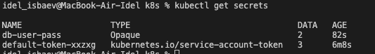
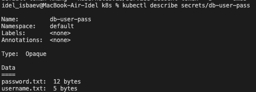
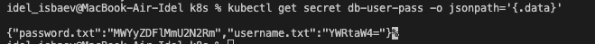
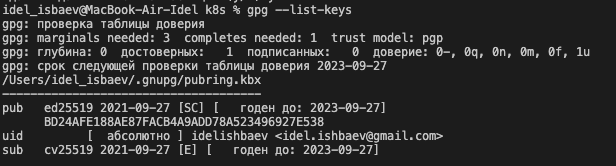
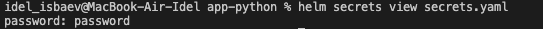
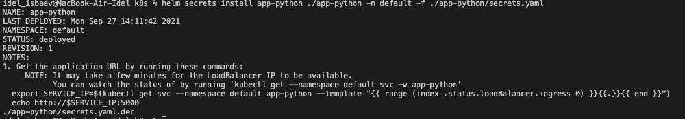
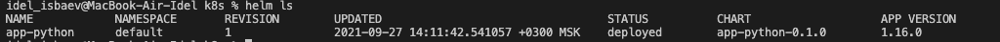
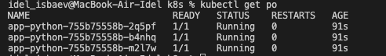
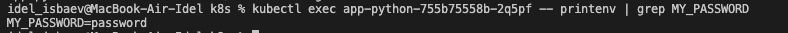
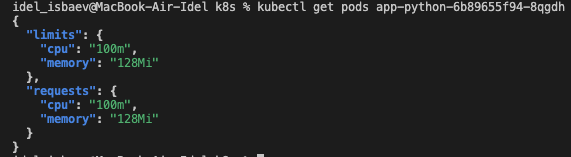

```
kubectl get secrets
```

```
kubectl describe secrets/db-user-pass
```

```
kubectl get secret db-user-pass -o jsonpath='{.data}'
```

```
echo 'MWYyZDFlMmU2N2Rm' | base64 --decode
```


### helm and resource managment















