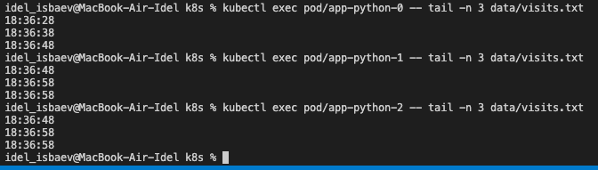
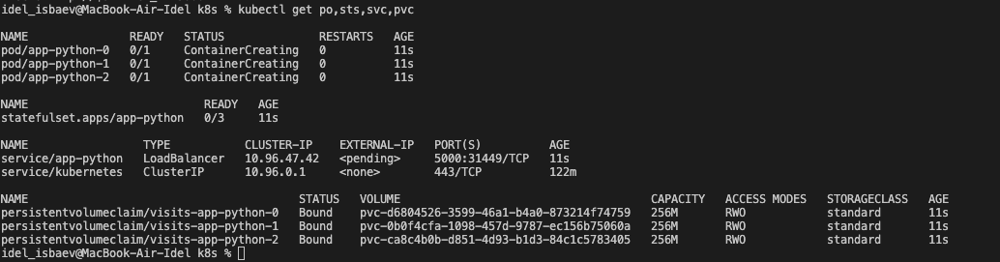

Each pod operates on separate file, thats why there are deifferent output of the command. Moreover, volumeClaimTemplates was used in templates and a template for pvc of each pod.

We can launch our pods in parallel beacuse our apps pods are independent.

Pod management can be OrderedReady and Parallel. Thats why change podManagementPolicy  to Parallel. 

