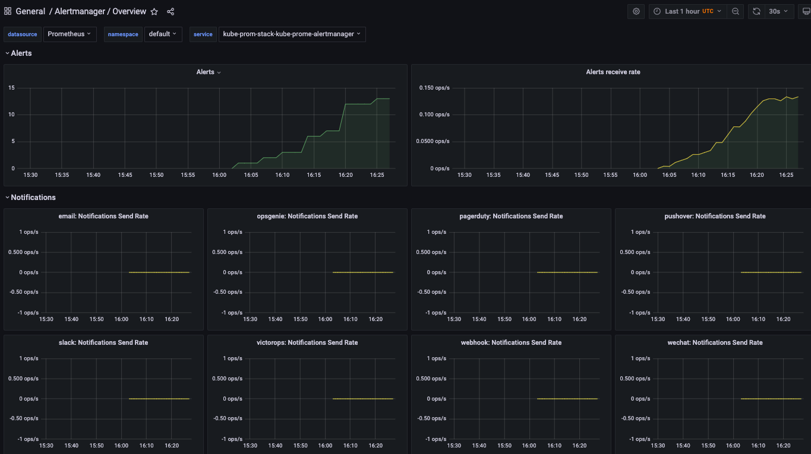

Prometheus operator simplifies & automates config. of a Prometheus

Prometheus - monitoring and alerting

AlertManager - Handle alerts from applications

Prometheus node-exporter handlea OS and hardware metrics from *NIX kernels

Prometheus Adapter for Kubernetes Metrics APIs - Resource, custom, external metrics APIs. Provides ability to customize metrics.

kube-state-metrics - generates metrics about the state of the object from Kubernetes API without modifications.

Grafana provides dashboards for metrics

## 1 
- ~0.0496, 
- ~0.005%

 ## 2 
 - kube-apiserver-minikube
 - alertmanager-kube-prom-stack-kube-prome-alertmanager-0

## 3 
- ~78%, 
- 1,41GiB

## 4 
- 18 pods, 
- 33 containers

## 5
- storage-provisioner
- coredns

## 6
- 13

## init container

