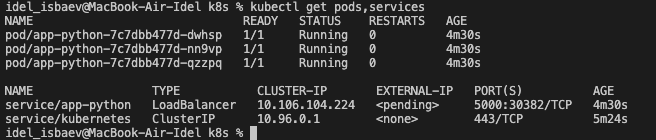
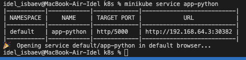
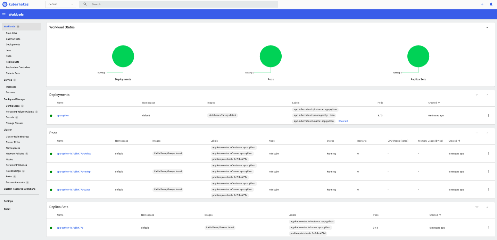
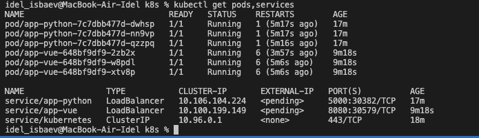
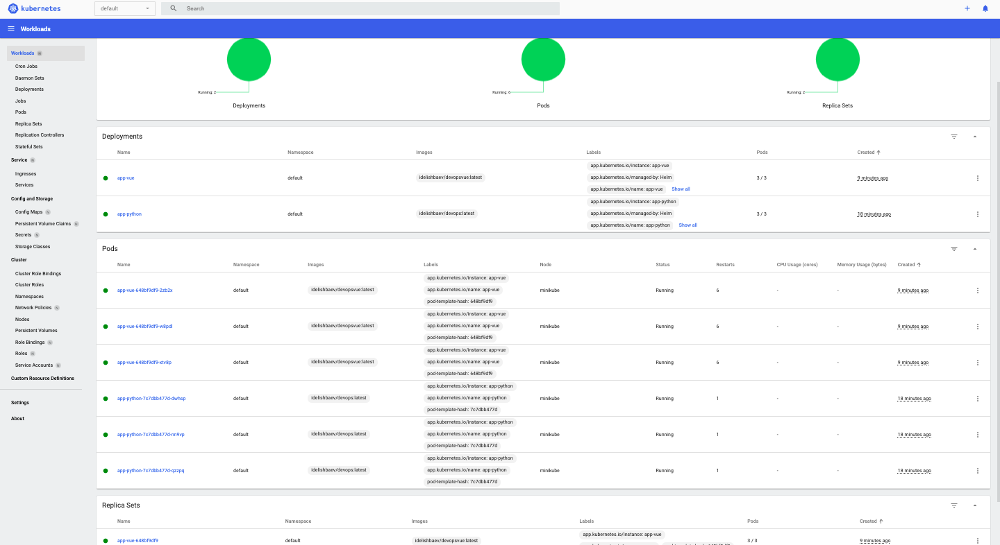

# lab9
report screenshots for both python and vue apps:


## manifest
### python app

### Vue.js app + python app

#### running app
Check if app is actually accessible and running can be checked by links (after runnig command below) after setting up.
```
minikube service app-vue-serv
OR
minikube service app-python-serv
```
- Ingress is used for managing users's access to the Kubernetes cluster services
- Ingress controleer is a load balancer that provides bridge btw Kubernetes services and external services. 
- StatefulSet manages deployment and scaling of set of Pods.
- DaemonSet ensure that Nodes run cope of Pod.
- PersistentVolumes offers Kub. applications a effecient way to request, consimbe and storage resources. In short, it is a piese of ctorage in a cluster.

# lab 10



## Vue.js app + python app





A library chart is a type of Helm chart. It can define chart primitives, and other Helm templates can share it in other charts in order to make users be able to share reusable snippets of code.