Best practices:
1. Loki
- Static labels are good
- Use dynamic labels sparingly
- Label values must always be bounded
- Be aware of dynamic labels applied by clients
- Configure caching
- Logs must be in increasing time order per stream
- Use chunk_target_size
- Use -print-config-stderr or -log-config-reverse-order
2. Logging 
- Logging Levels separation
- Basic Logging Configuration in the entrypoint
- Don’t Reinvent the Wheel
- Use the Correct Levels When Logging
- Include a Timestamp for Each Log Entry
- Use the Rotating
3. Grafana 
- A dashboard should tell a story or answer a question
- Dashboards should reduce cognitive load, not add to it
- When creating a new dashboard, make sure it has a meaningful name.
- If you create many related dashboards, think about how to cross-reference them for easy navigation.
- Avoid unnecessary dashboard refreshing to reduce the load on the network or backend.
- Use the left and right Y-axes when displaying time series with different units or ranges.
- Add documentation to dashboards and panels.
- Reuse your dashboards and enforce consistency by using templates and variables.
- Be careful with stacking graph data.
- The visualizations can be misleading, and hide important data. Recommended turning it off in most cases.

## run
```
docker-compose up
```
## screenshots:
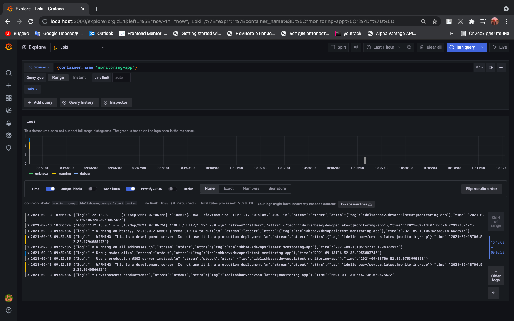

# Bonus task
second app in folder app_vue
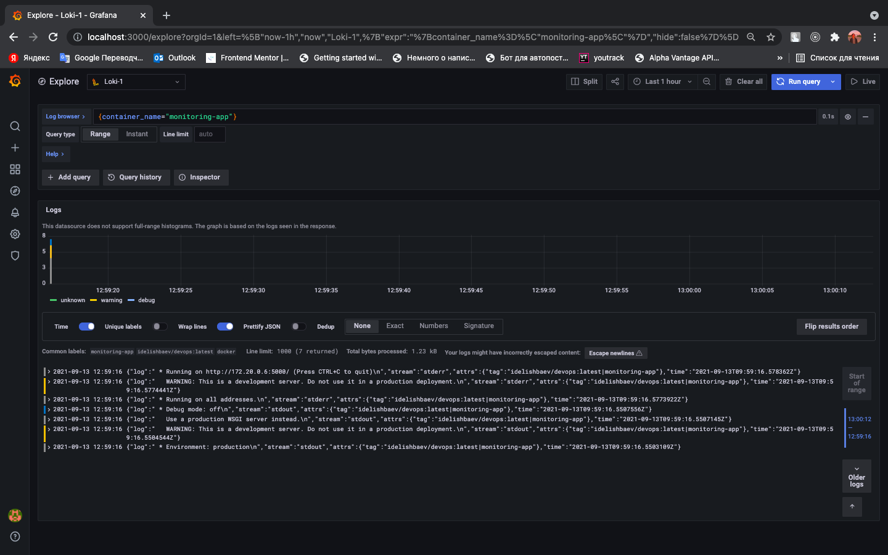
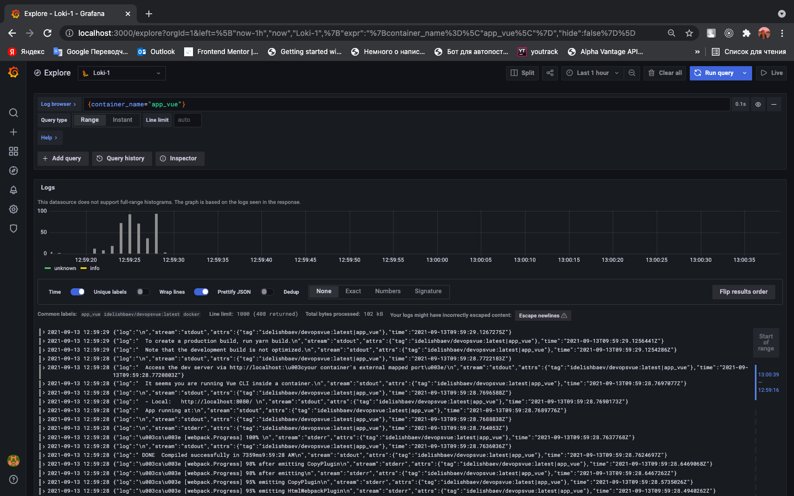
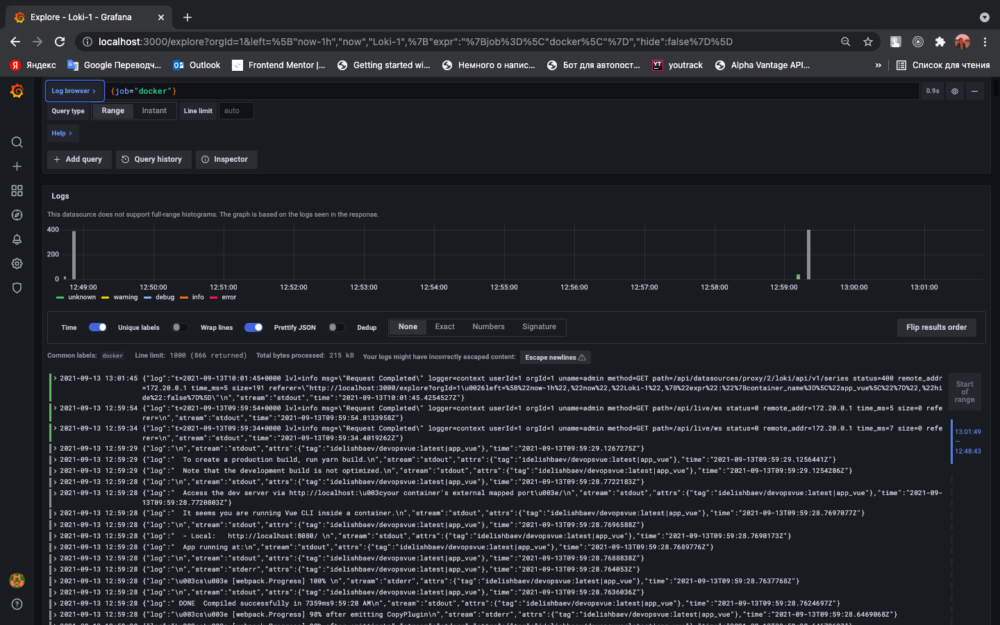

# lab8
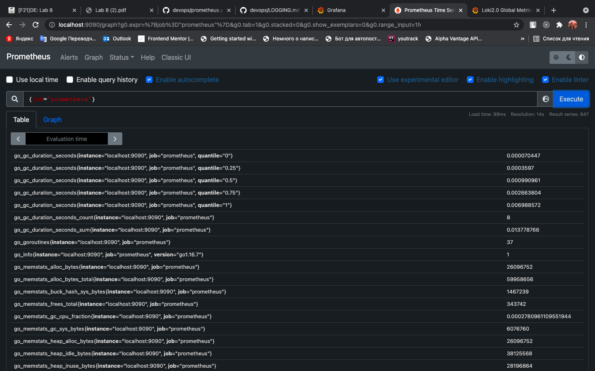
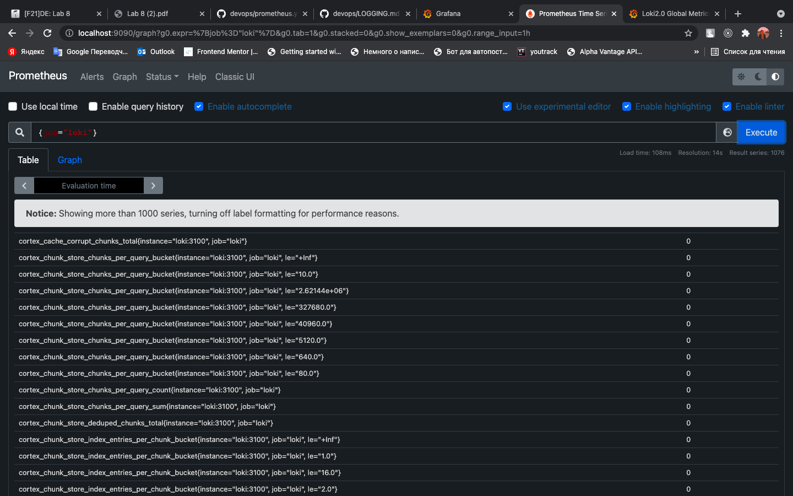
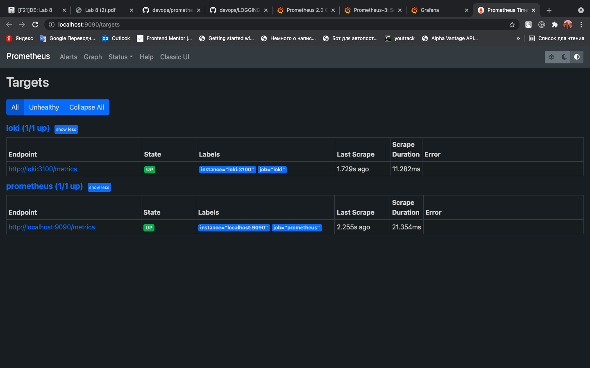
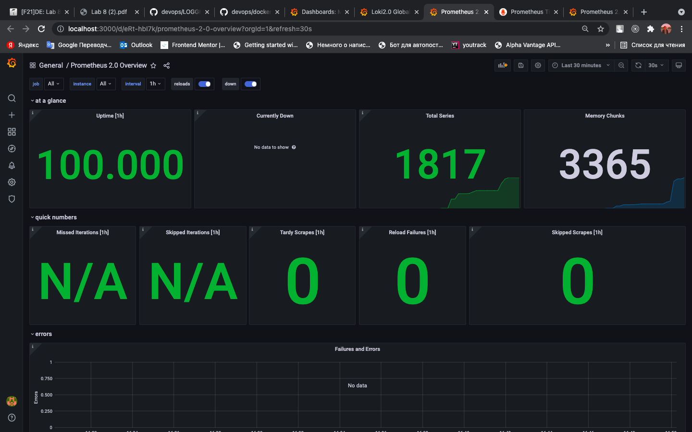
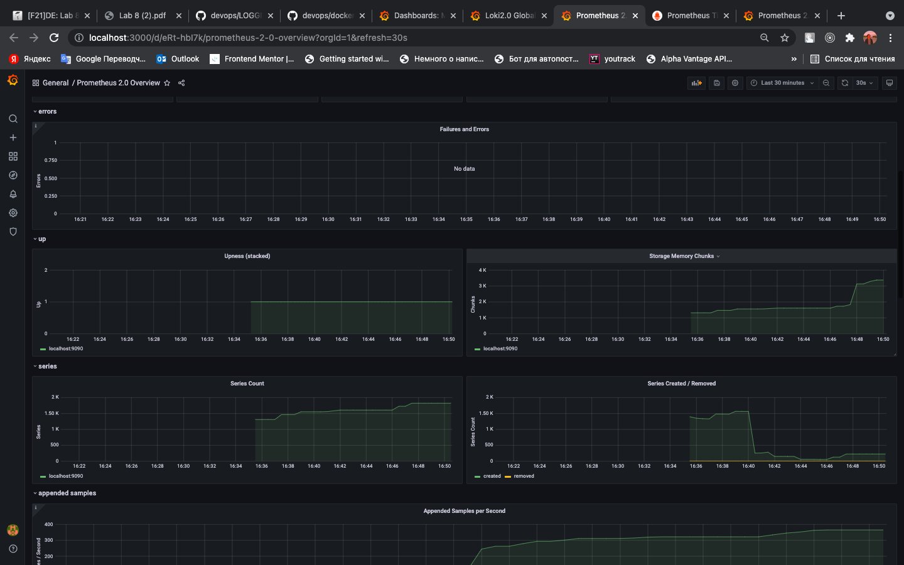
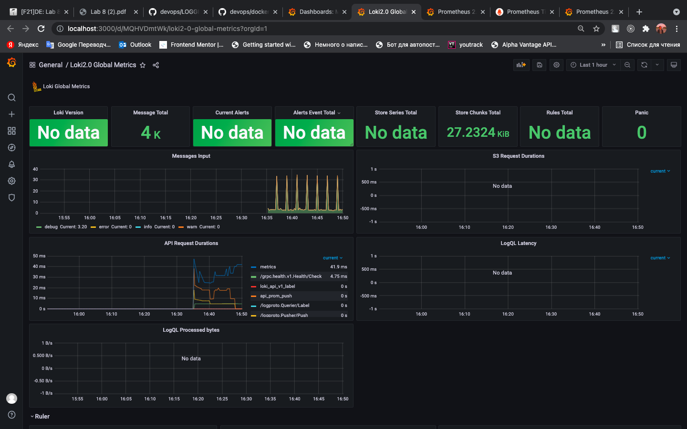
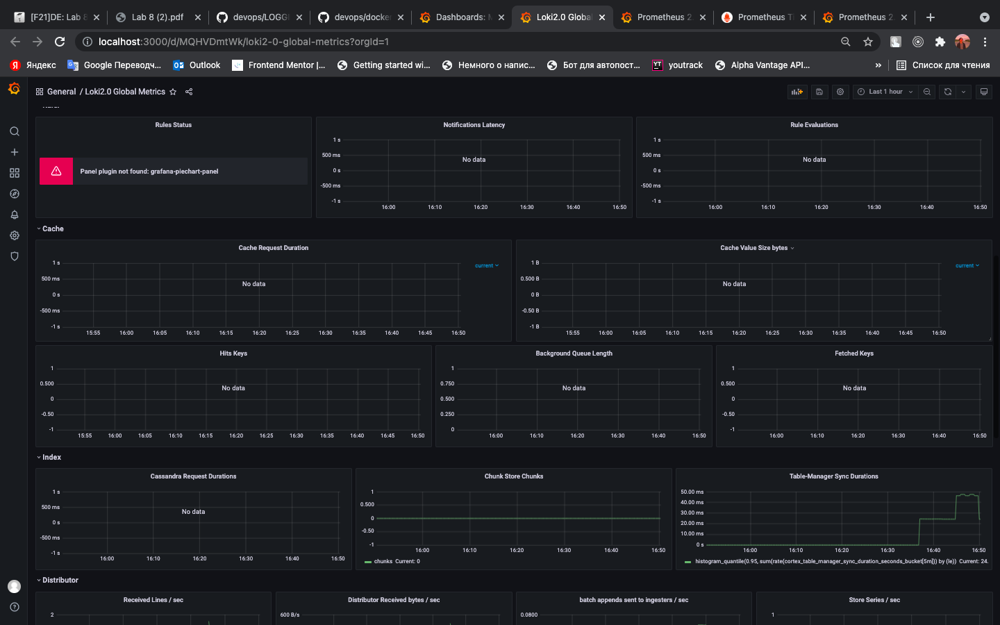

